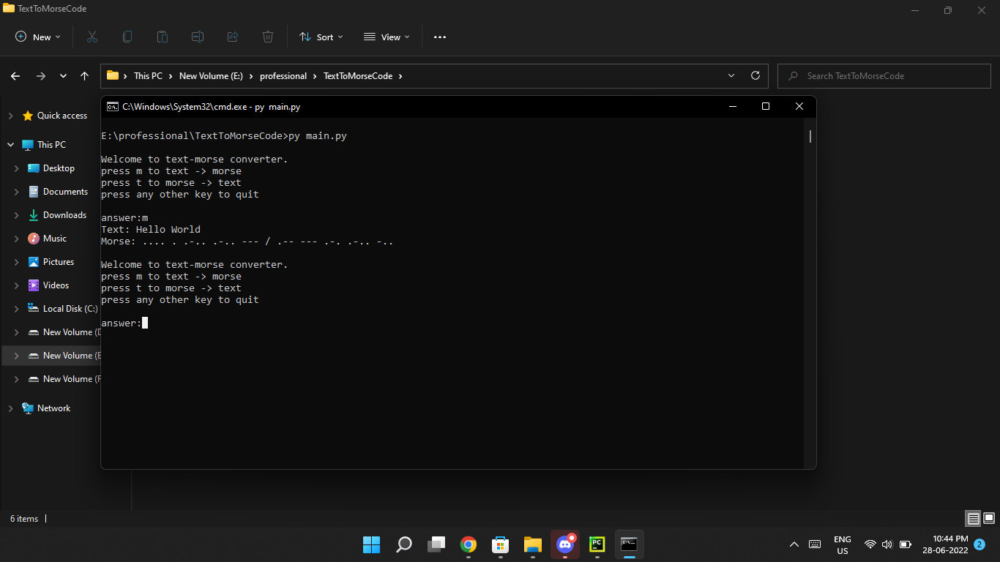

# Text To Morse Code
Morse code is a method used in telecommunication to encode text characters as standardized sequences of two different signal durations, called dots and dashes, or dits and dahs.

## Run Script
```commandline
git clone https://github.com/viralRupani/Morse-Code
cd Morse-Code
python main.py
```

## Example
